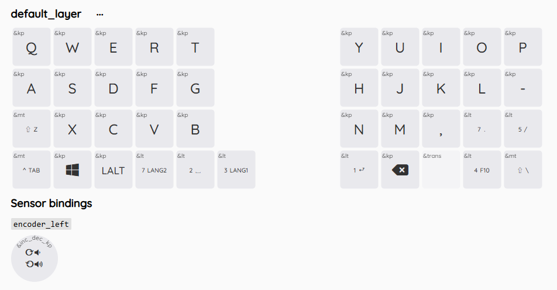
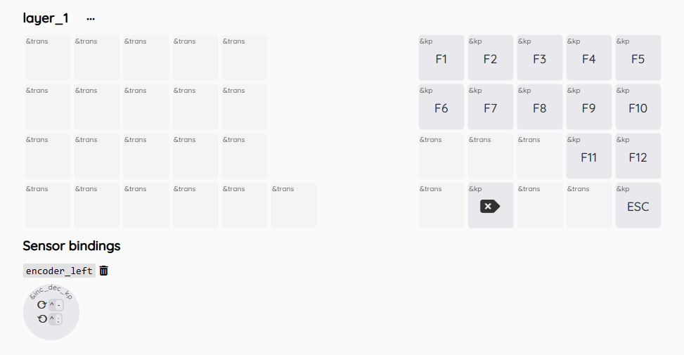
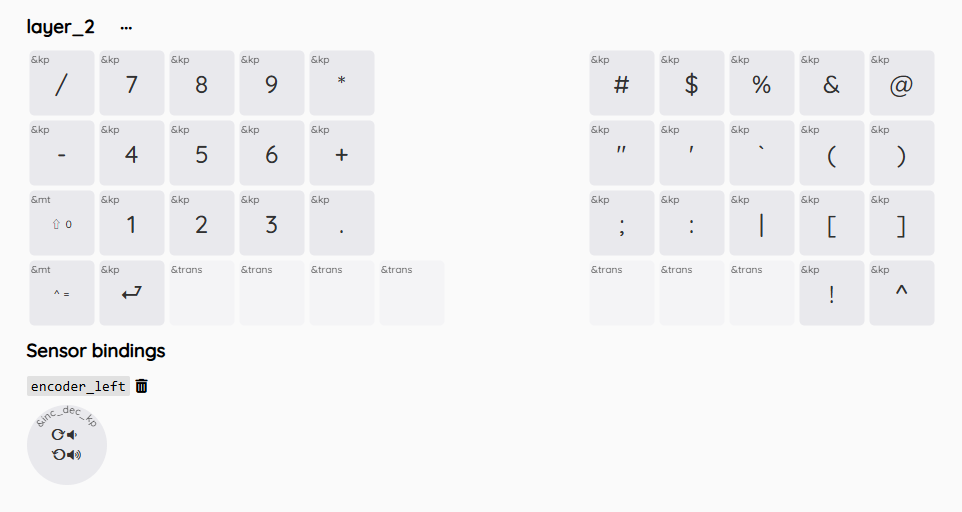
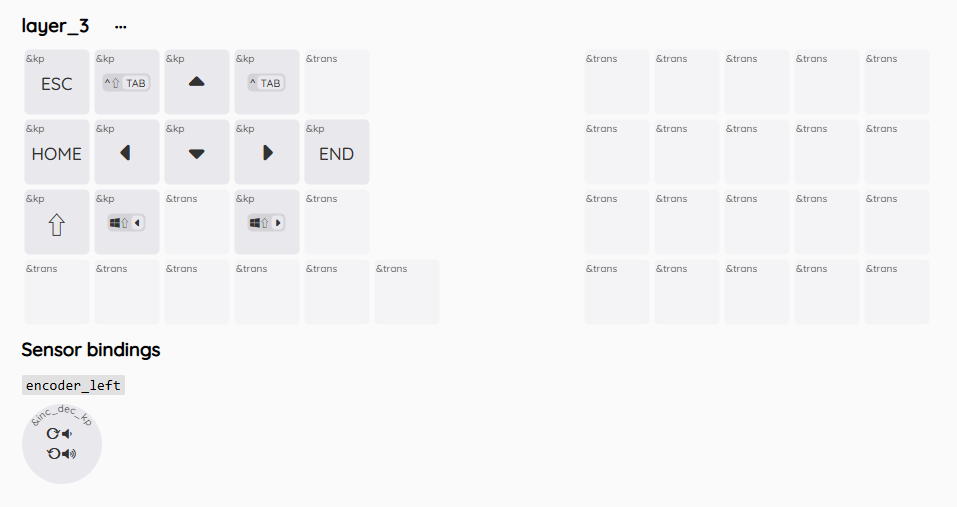
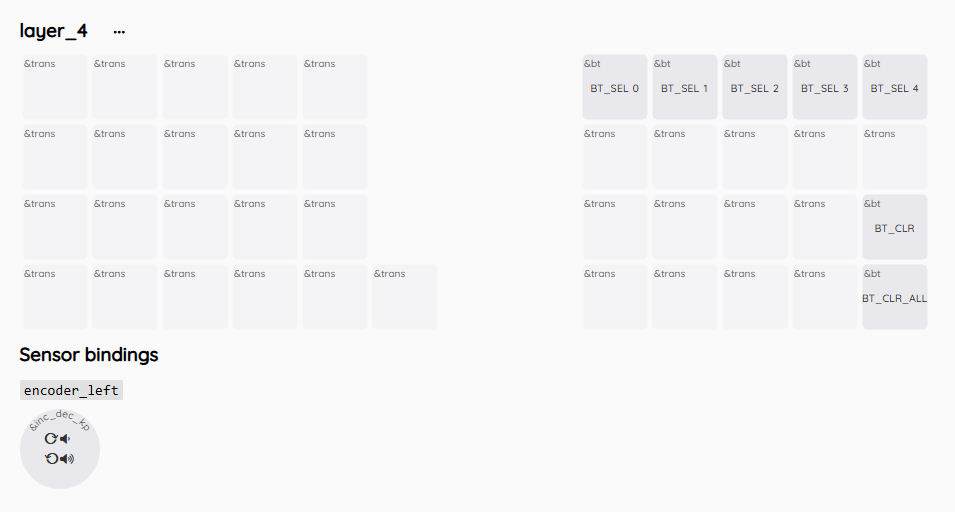
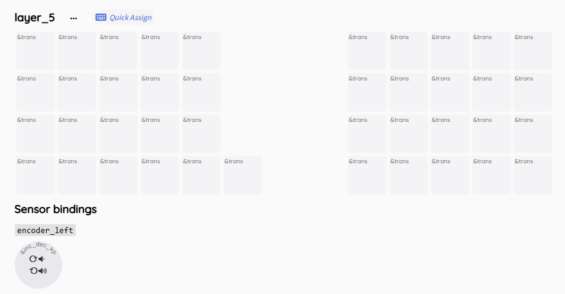
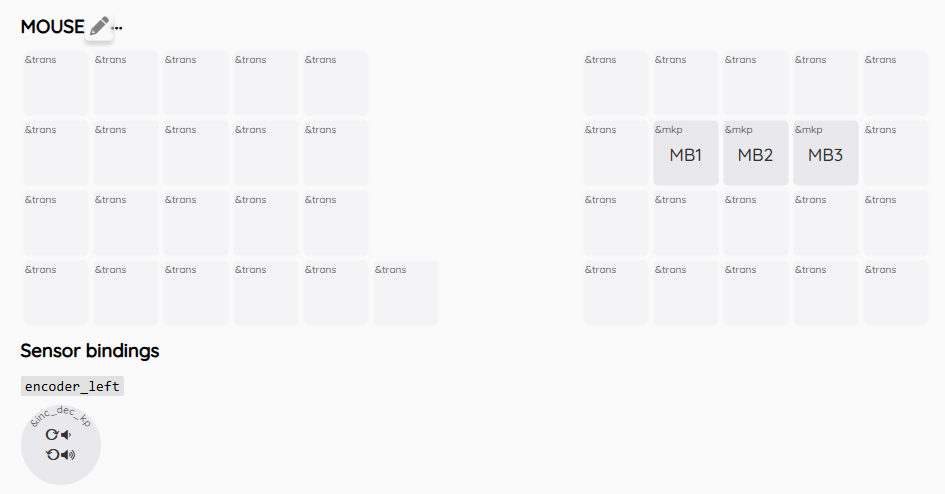
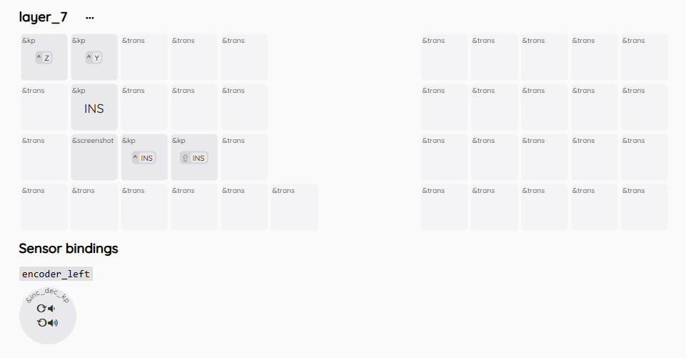

# FrostOrtho 初期キーマップ

## ビルドガイド
ビルドガイドは[こちら](./doc/ビルドガイド.md)

## キーマップ

### レイヤー0
デフォルトのレイヤー  
「⇧Z」など2種類記載されているキーは、ModTapです。  
「⇧Z」の場合、短押しではZが入力され、長押しでは⇧（Shift）が入力されます。  
- 数字：押している間各レイヤーに切り替わる
- ⇧：Shift  
- ＾：Control
- ↵ ：Enter
- LANG1：ひらがな
- LANG2：半角英数字

### レイヤー1
ファンクションキー  

### レイヤー2
数字・記号キー  

### レイヤー3
方向キー、タブ切り替えなど  

### レイヤー4
Bluetoothの設定や切り替えをする  
最大5台の端末にてマルチペアリングが可能です。キーボードの電源をオンにしたのちBT_SEL_0 ～ BT_SEL_4のいずれかを押して端末と接続してください。
- BT_CLR：選択中のBluetooth設定を初期化する
- BT_CLR_ALL：5個すべてのBluetooth設定を初期化する

### レイヤー5
縦スクロールレイヤー  
キーはデフォルトでは未割当  

### レイヤー6
マウスレイヤー  
組み立て済み品の場合オートマウスレイヤーが有効になっているため、トラックボールを動かした後にJ、K、Lを押すとMB1、MB2、MB3になります。  
J、K、L、Shift、Contrl、Alt以外のキーを押すとキー入力モードに戻ります。  
- MB1：左クリック
- MB2：右クリック
- MB3：中央クリック

### レイヤー7
マクロ・横スクロールレイヤー  
個人的によく使用するスクリーンショットやInsertを使用するコピー・ペースト等を設定しています。  

