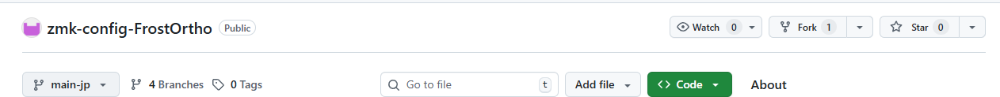
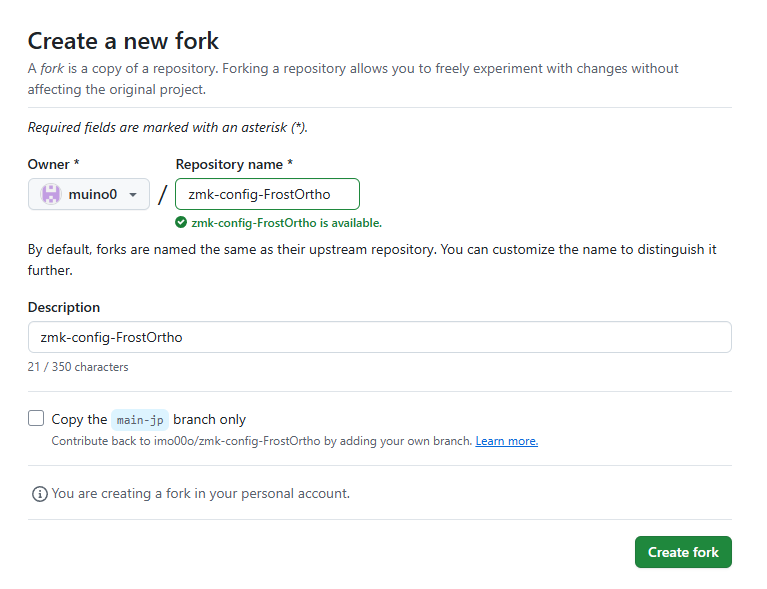
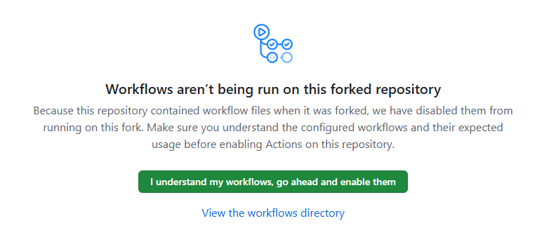
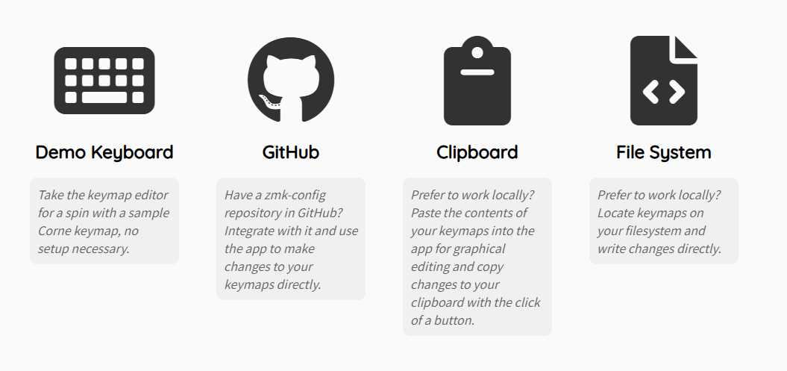
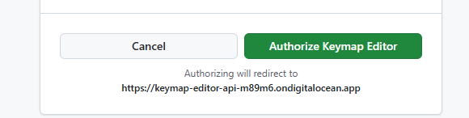
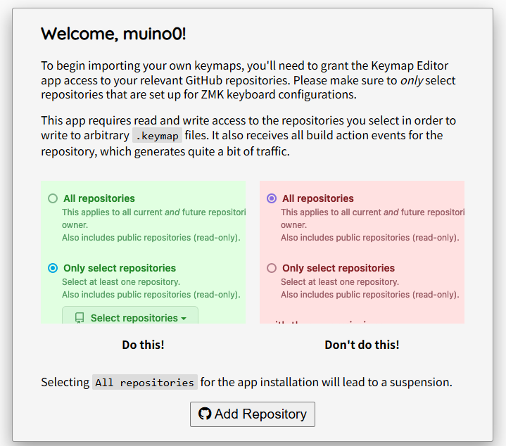
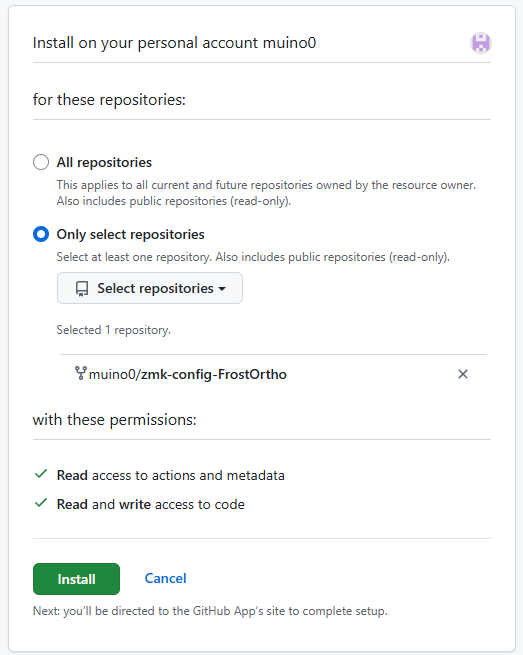
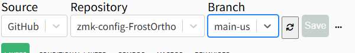
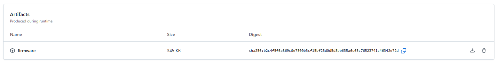

# FrostOrtho ビルドガイド
編集中。組立済みと自作キットは分ける。

## 内容物
### 組立済み品
#### 同梱品
| 部品名 | 数 | 説明 |
| ---- | ---- | ---- |
| トップケース | 2（左右） | キーボードの外装 |
| ボトムケース | 2（左右） | キーボードの外装 |
| スイッチプレート | 2（左右） | キースイッチを固定するプレート |
| GRIPLUS（底面すべり止め） | 4 | 購入時は透明のシートが貼ってあるため剥がしてご使用ください。 |
| スイッチカバー | 2 | オンオフがわかるスイッチカバー |
| キーキャップ(ノーマル) | 34～ | 指の形に沿うような形のキーキャップ。予備も入っています。 |
| キーキャップ(ホーミング) | 2 | F,Jキーに使用するホーミング付きキーキャップ。予備なしです。 |
| キーキャップ(コンベックス) | 8～ | 親指用のキーキャップ。予備も入っています。 |
| リセットスティック | 2～ | ファームウェア書き込み時に使用するスティック。小さく無くしやすいので予備も入っています。 |
| ノブ | 1 | ロータリーエンコーダーのノブ |
| トラックボールカバー | 1 | マグネットでケース本体とつけ外し可能 |
| 19mm PTFE球 | 1 | トラックボール |
| 基板 | 2（左右） | キーボードの基板 |
| xiao nRF | 2 | マイコン |
| choc v2 ソケット | 41 | キーソケット |
| ダイオード | 42 | ダイオード |
| ロープロファイルロータリーエンコーダー | 1 | 背の低いロータリーエンコーダー。軽い力で回せるようトルクを外す改造をしています。 |
| 電源スイッチ | 2 | タクトスイッチ |
| PHコネクタ | 2 | バッテリーを基板と接続するコネクタ |
| トラックボール用基板 | 1 | トラックボール用基板 |
| PMW3610 | 1 | 光学センサー |
|  | 1 | レンズ |
| Lipoバッテリー | 2 | 充電池。取り扱いにはご注意ください。 |

#### 別途購入が必要
| 部品名 | 数 | 説明 |
| ---- | ---- | ---- |
| choc v2 キースイッチ | 41 | 3ピンのchoc v2 スイッチにのみ対応しています。4ピンのもの、choc v1には対応していません。 LofreeのキースイッチやKailh Deep Sea miniシリーズ等が使用できます。 |

### 自作キット
#### 同梱品
| 部品名 | 数 | 説明 |
| ---- | ---- | ---- |

#### 別途購入が必要
| 部品名 | 数 | 説明 | 購入先
| ---- | ---- | ---- | ---- |

## 組み立て方法

### はんだ付け

### キースイッチを交換する
狭ピッチなので、一般的なキースイッチプラーでキースイッチを取り外すことが困難な場合が多いです。。  
ケースから基板を取り出し、裏からキースイッチを押すと取り外しやすいです。  

### ケースから基板を取り出す
ケースの固定にはネジを使用しておらず、スナップフィット機構にて固定しています。  
左手側はQキー辺りの位置を、右手側はPキー辺りの位置を上から押してボトムケースを外してください。  
長辺側に爪があるため、短辺側を手で持ちながらつけ外しするとスムーズです。

ケースを外す際にリセットスティックが落ちやすいので無くさないようご注意ください。

## キーマップの変更方法
・[DYA Studio](https://studio.dya.cormoran.works/)で変更する ← おすすめ  
    右手側キーボードとPCを有線接続するだけで簡単にキーマップ・トラックボール速度等の変更ができ、ファームウェアの書き込みも不要です。iPadでも使用可能です。  

・Keymap Editorで変更する  
    GitHubアカウントの作成が必要になり、変更するたびファームウェアの書き込みが必要になります。キーマップの変更ができますが、トラックボール速度等は変更できません。 

・ファームウェアを直接書き換える  
    自由に変更や設定追加ができます。

### DYA Studio を使用したキーマップ変更方法
[DYA Studio](https://studio.dya.cormoran.works/)にアクセスして有線もしくはBluetooth接続を選択する。
変更を許可するためにレイヤー4の以下キーを押下する。  

自由にキーマップを変更ください。

### Keymap Editor を使用したキーマップ変更方法

1. [ファームウェア用リポジトリ](https://github.com/imo00o/zmk-config-FrostOrtho)へアクセスする。

2. 「fork」をクリックしてリポジトリをフォークする。

3. 「Copy the main-jp branch only」のチェックを外して「Create fork」をクリックする。

4. Create fork をクリックする

5. フォークができたら、Actions タブを開く。

6. 「I understand my workflows, go ahead and enable them」をクリックし、GitHub Actionsを有効化する。

7. [Keymap Editor](https://nickcoutsos.github.io/keymap-editor/)へアクセスする。

8. GitHub を選択する。

9. 「Login with GitHub」をクリックし、画面に従ってログインする。

10. 「Authorize Keymap Editor」をクリックする。

11. 「Add Repository」をクリックする。

12. 「Only select repositories」を選択し、「Select repositories」からzmk-config-FrostOrthoを選択する。  
Installをクリックする。  

13. キーマップ変更画面が表示されたら、使用したい配列に従いブランチを選択してキーマップを編集する。
- 日本語配列用キーマップ（オートマウスレイヤー有効）：main-jp-aml
- 日本語配列用キーマップ（オートマウスレイヤー無効）：main-jp
- 英語配列用キーマップ（オートマウスレイヤー無効）：main-us  
※ developブランチは開発途中の場合があるため使用しないでください。  
※ Keymap Editorは日本語配列には対応していないため、エディター上の表示と実際押したときのキーが異なるものがあります。

14. キーマップの変更が終わったら、「Save」をクリックする。

15. 「Latest」をクリックするとGitHub Actionsの画面へ遷移する。  
ビルドが完了するとファームウェアのダウンロードが可能となるのでダウンロードする。  
※ ビルドには2分程度かかる

### ファームウェアの書き換え
Keymap Editor を使用したキーマップ変更方法 の1~6を実施したのち、自由にファイルの中身を変更ください。    
変更内容をgit pushするとActionsタブにファームウェアが出力されます。

### ファームウェアの書き込み方法
事前にGitHub Actionsからファームウェアのダウンロードと解凍を済ませておいてください。  

1. 右手側キーボードとPCをケーブルで接続し、リセットスティックを2回押す

2. XIAO-SENSE(D:)のウィンドウが表示されるため、以下ファイルをドラッグ&ドロップして書き込む
    - FrostOrtho_R rgbled_adapter-seeeduino_xiao_ble-zmk.uf2

3. キーマップ以外の修正をした場合は、左手側キーボードも同じ手順で以下のファイルを書き込む
    - FrostOrtho_L rgbled_adapter-seeeduino_xiao_ble-zmk.uf2

4. 正常に書き込みできれば完了

#### エラー発生時
書き込み中にエラーが発生した場合は、以下リセット用ファイルを同様の手順で書き込んでください。その後、もう一度ファームウェアの書き込みを実施してください。
- settings_reset-seeeduino_xiao_ble-zmk.uf2
