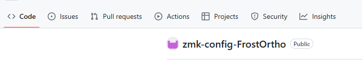
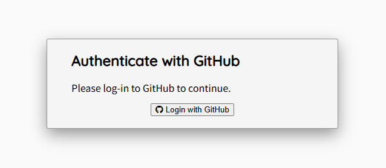

# FrostOrtho ビルドガイド

## 組み立て方法

### 


## キーマップの変更方法

### 前提
- GitHubアカウントを作成していること

### Keymap Editor を使用したキーマップ変更方法

1. [ファームウェア用リポジトリ](https://github.com/imo00o/zmk-config-FrostOrtho)へアクセスする。

2. 「fork」をクリックしてリポジトリをフォークする。


3. 「Copy the main-jp branch only」のチェックを外して「Create fork」をクリックする。


4. Create fork をクリックする

5. フォークができたら、Actions タブを開く。


6. 「I understand my workflows, go ahead and enable them」をクリックし、GitHub Actionsを有効化する。


7. [Keymap Editor](https://nickcoutsos.github.io/keymap-editor/)へアクセスする。

8. GitHub を選択する。


9. 「Login with GitHub」をクリックし、画面に従ってログインする。


10. 「Authorize Keymap Editor」をクリックする。


11. 「Add Repository」をクリックする。


12. 「Only select repositories」を選択し、「Select repositories」からzmk-config-FrostOrthoを選択する。  
Installをクリックする。  


13. キーマップ変更画面が表示されたら、使用したい配列に従いブランチを選択してキーマップを編集する。
- 日本語配列用キーマップ（オートマウスレイヤー有効）：main-jp-aml
- 日本語配列用キーマップ（オートマウスレイヤー無効）：main-jp
- 英語配列用キーマップ（オートマウスレイヤー無効）：main-us  
※ developブランチは開発途中の場合があるため使用しないでください。  
※ Keymap Editorは日本語配列には対応していないため、エディター上の表示と実際押したときのキーが異なるものがあります。


14. キーマップの変更が終わったら、「Save」をクリックする。

15. 「Latest」をクリックするとGitHub Actionsの画面へ遷移する。  
ビルドが完了するとファームウェアのダウンロードが可能となるのでダウンロードする。  
※ ビルドには2分程度かかる


### ファームウェアの書き換え
Keymap Editorでは変更できないトラックボールのカーソル速度やスクロールの挙動などを変更したい場合は、以下を参考にフォークしたリポジトリ内のファイルを変更してください。

#### カーソル速度・スクロール設定
- FrostOrtho_R.overlay

```
/ {
    trackball_listener: trackball_listener {
        status = "okay";
        compatible = "zmk,input-listener";
        device = <&trackball>;

        input-processors = <
            &zip_temp_layer 6 100000 // AMLレイヤー、タイムアウト時間
            &zip_xy_scaler 5 3 // カーソル移動速度5/3倍
        >;

        scroller {
            layers = <5>; // スクロールレイヤー
            input-processors = <
                &zip_xy_to_scroll_mapper
                &zip_scroll_scaler 2 3 // スクロール速度2/3倍
                &zip_scroll_transform INPUT_TRANSFORM_Y_INVERT // スクロールのY方向を反転
            >;
        };
    };
};
```

- 参考  
https://zenn.dev/kot149/articles/zmk-input-processor-cheat-sheet

#### オートマウスレイヤー
オートマウスレイヤーの設定についてはkotさんの記事を参考にさせていただきました。細かな調整をしたい場合は以下の記事を見ながら変更してください。
- 参考  
https://zenn.dev/kot149/articles/zmk-auto-mouse-layer


### ファームウェアの書き込み方法
事前にファームウェアのダウンロードと解凍を済ませておいてください。  

1. 右手側キーボードとPCをケーブルで接続し、リセットスティックを2回押す

2. XIAO-SENSE(D:)のウィンドウが表示されるため、以下ファイルをドラッグ&ドロップして書き込む
    - FrostOrtho_R rgbled_adapter-seeeduino_xiao_ble-zmk.uf2

3. キーマップ以外の修正をした場合は、左手側キーボードも同じ手順で以下のファイルを書き込む
    - FrostOrtho_L rgbled_adapter-seeeduino_xiao_ble-zmk.uf2

4. 正常に書き込みできれば完了

#### エラー発生時
書き込み中にエラーが発生した場合は、以下リセット用ファイルを同様の手順で書き込んでください。その後、もう一度ファームウェアの書き込みを実施してください。
- settings_reset-seeeduino_xiao_ble-zmk.uf2
