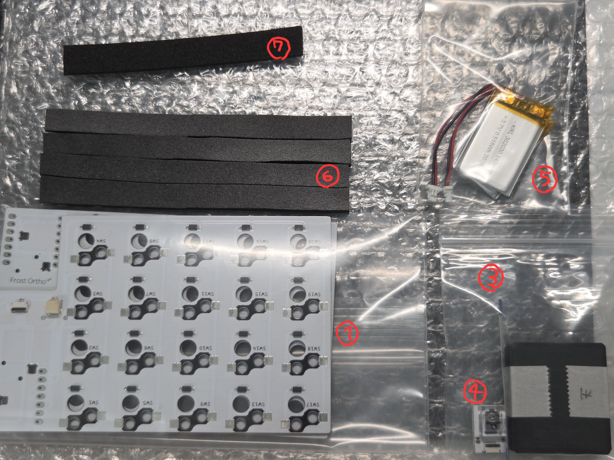
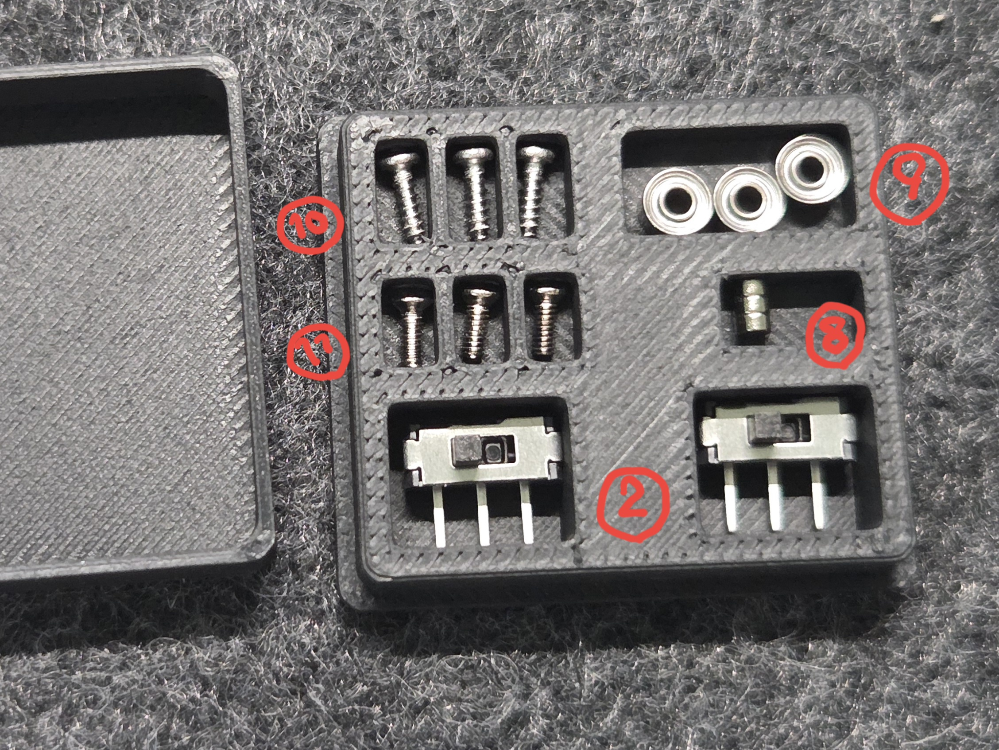

# 自作キット(ケースなし) ビルドガイド

## 内容物
| 部品番号 | 部品名 | 数 | 説明 | 備考 |
| ---- | ---- | ---- | ---- | ---- |
| 1 | 基板 | 2（左右） | キーボードの基板 |  |
| 2 | 電源スイッチ | 2 | スライドスイッチ | https://shop.yushakobo.jp/products/5624?_pos=1&_sid=2c5ae4069&_ss=r |
| 3 | リボンケーブル | 1 | センサーモジュールとメイン基板を接続する |  |
| 4 | センサーモジュール | 1 | 基板 + PAW3222LU-TJDU + PNSR-015-RB3 |  |
| 5 | Lipoバッテリー | 2 | jst sh1.0コネクタ付き充電池 | |
| 6 | スポンジシート(3mm) | 4 | ボトムケースに敷くスポンジシート | https://www.amazon.co.jp/dp/B00G468722?ref=ppx_yo2ov_dt_b_fed_asin_title&th=1 |
| 7 | スポンジシート(2mm) | 1 | トップケースに貼るスポンジシート。貼る場所に合わせて切ってご使用ください。  2mmくらいの厚さで弾力があればいいので、透明ケースの場合は透明のゲル状テープが見た目綺麗でおすすめです。 | https://www.amazon.co.jp/dp/B0DDJDYVHX?ref_=ppx_hzsearch_conn_dt_b_fed_asin_title_5&th=1 |
| 8 | マグネット(直径2mm × 厚さ1mm) | 3 | トラックボールケースとトップケースを着脱可能にするための磁石 | https://www.amazon.co.jp/dp/B0FXB1RH63?ref_=ppx_hzsearch_conn_dt_b_fed_asin_title_1&th=1 |
| 9 | ベアリング(外形4mm 内径1.5mm 幅2mm) | 3 | トラックボールのベアリング | https://www.amazon.co.jp/dp/B0836S5376?ref_=ppx_hzsearch_conn_dt_b_fed_asin_title_6&th=1 |
| 10 | ネジ(M1.4 × 5mm) | 3 | ベアリングを固定するねじ、先端がとがっている | https://www.amazon.co.jp/dp/B076ZCH1NJ?ref_=ppx_hzsearch_conn_dt_b_fed_asin_title_1 |
| 11 | ネジ(M1.4 × 3mm) | 3 | マグネットとくっつくねじ、先端がとがっていない |  |

### 別途購入が必要
| 部品番号 | 部品名 | 数 | 説明 | 購入先例
| ---- | ---- | ---- | ---- | ---- |
| 1 | choc v2 キースイッチ | 41 | 3ピンのchoc v2 スイッチにのみ対応しています。4ピンのもの、choc v1には対応していません。 | 遊舎工房、TALP KEYBOARD、Lofree、JezailFunder、AliExpressなど |
| 2 | すべり止め | - | 底面に貼るすべり止め | 薄いのがよければ ⇒ https://www.amazon.co.jp/dp/B0CT8LCK52?ref=ppx_yo2ov_dt_b_fed_asin_title&th=1 |
| 3 | Seeed Studio XIAO nRF52840 | 2 | マイコン | 遊舎工房、TALP KEYBOARD、秋月電子など |
| 4 | Kailh Switch Socket choc(ロープロファイル)用 | 41 | choc用キーソケット | 遊舎工房、TALP KEYBOARDなど |
| 5 | ロープロファイルロータリーエンコーダー | 1 | 背の低いロータリーエンコーダー | https://shop.yushakobo.jp/products/2141?_pos=1&_sid=3c8fc5e4b&_ss=r&variant=37799941963937 |
| 6 | 19mm トラックボール | 1 | トラックボール | beekeebなど |

## 内容物確認
  
  

## 組み立て
[ケース作成（v1.1.0 ～ v1.2.0）](https://github.com/imo00o/FrostOrtho-3dprint-data)の手順でケースの準備、組み立てを行ってください。  

ケースの組み立てが完了したら、[はんだ付け](./自作キットビルドガイド.md)手順を進めてください。
